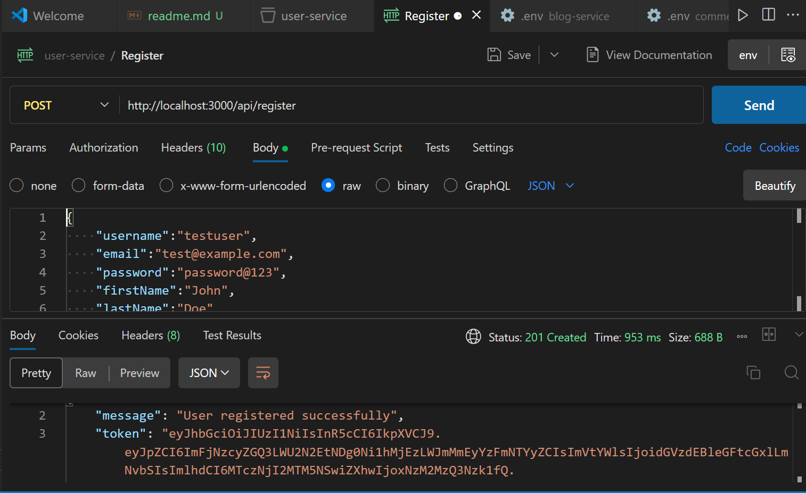
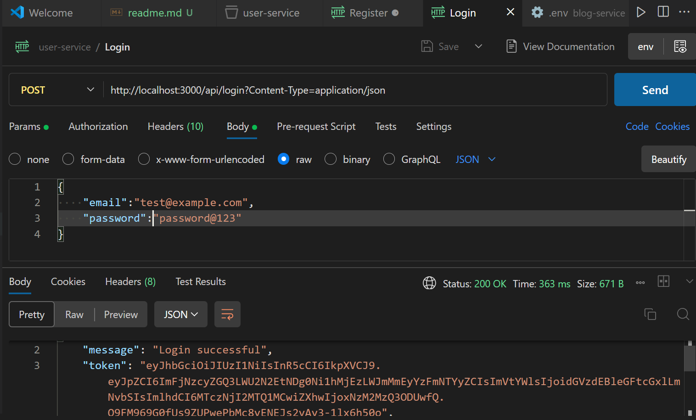
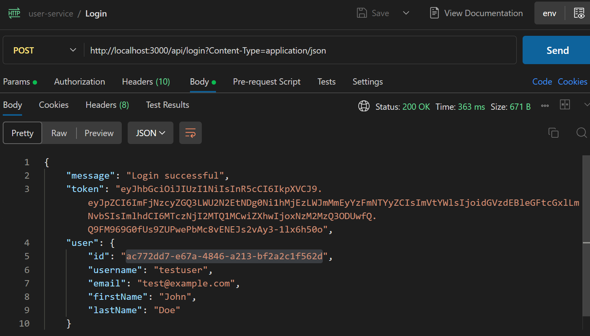
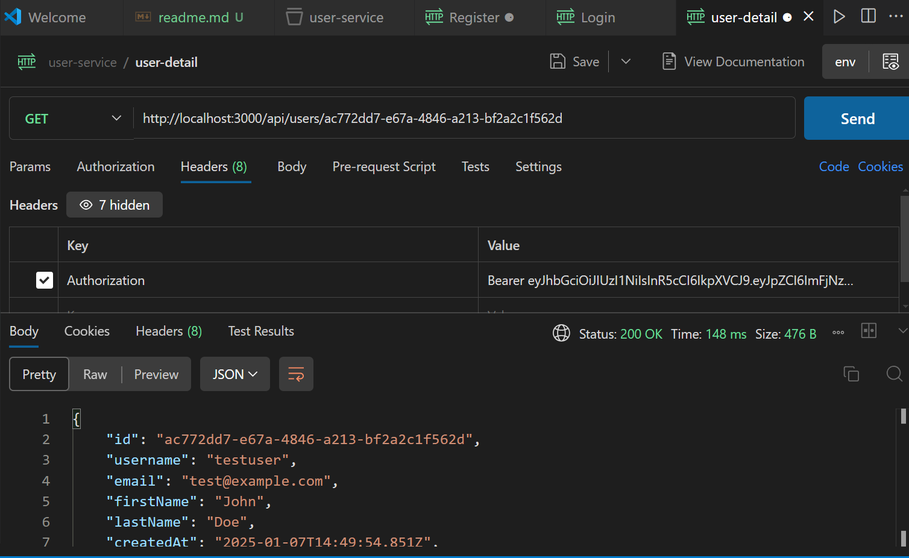
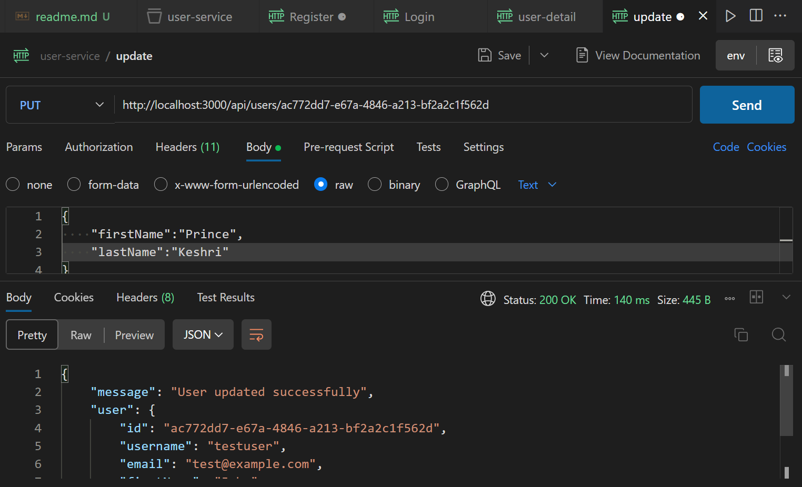

# 🚀 Multi-Service Blog Platform

> 🌟 A modern, containerized blog platform built with microservices architecture, featuring user authentication, blog post management, and commenting capabilities.

## ✨ Features

### 👤 User Service (Port: 3000)
- 🔐 Secure user authentication using JWT
- 🔒 Password encryption with bcrypt
- 👤 User profile management
- 🗄️ Independent PostgreSQL database

### Blog Service (Port: 4000)

### Comment Service (Port: 5000)

#### 🔍 API Endpoints:
1. **Register User** 📝
   ```http
   POST /api/register
   ```
   - Creates new user account
   - Returns JWT token
   - 

2. **Login** 🔑
   ```http
   POST /api/login
   ```
   - Authenticates user credentials
   - Returns JWT token
   - 
   - From here token details and user id information is retrived.
   - 

3. **Get User Details** 📋
   ```http
   GET /api/users/:id
   ```
   - Retrieves user profile information
   - Requires JWT authentication
   - 

4. **Update User** ✏️
   ```http
   PUT /api/users/:id
   ```
   - Updates user profile information
   - Requires JWT authentication
   - 

5. **Delete User** 🗑️
   ```http
   DELETE /api/users/:id
   ```
   - Removes user account
   - Requires JWT authentication

### 📝 Blog Service (Port: 4000)
- ✍️ Create and manage blog posts
- 📄 Pagination support for post listings
- 🗄️ Independent PostgreSQL database

### 💬 Comment Service (Port: 5000)
- 💭 Add comments to blog posts
- 🔄 Flat comment structure (expandable to nested)
- 🗄️ Independent PostgreSQL database

## 🛠️ Technology Stack

- **🔙 Backend**: Node.js, Express.js
- **🗄️ Database**: PostgreSQL
- **🔐 Authentication**: JWT (JSON Web Tokens), Bycrypt (Password encryption)
- **🐳 Containerization**: Docker
- **☁️ Cloud Platform**: AWS EC2
- **🧪 API Testing**: Postman

## 📋 Prerequisites

- ⚙️ Node.js (v14 or higher)
- 🐳 Docker and Docker Compose
- 🗄️ PostgreSQL
- ☁️ AWS Account (for deployment)

## 🚀 Getting Started

### 💻 Local Development

1. **Clone the repository**
```bash
git clone https://github.com/princekeshriabc/multi-service-blog
cd multi-service-blog
```

2. **Set up environment variables**
```bash
# Create .env files in each service directory
cp user-service/.env
cp blog-service/.env
cp comment-service/.env
```

3. **Start services using Docker Compose**
```bash
docker-compose up --build
```

4. **Access services**
```http
User Service: http://localhost:3000
Blog Service: http://localhost:4000
Comment Service: http://localhost:5000
```

## ☁️ AWS Deployment

1. **Launch EC2 Instance**
- 💫 Use Amazon Linux 2 AMI
- 🔒 Configure security groups for ports 3000, 4000, 5000

2. **Install Dependencies**
```bash
# Update system packages
sudo yum update -y

# Install Docker
sudo yum install docker -y
sudo service docker start
sudo usermod -a -G docker ec2-user

# Install Docker Compose
sudo curl -L "https://github.com/docker/compose/releases/download/v2.20.0/docker-compose-$(uname -s)-$(uname -m)" -o /usr/local/bin/docker-compose
sudo chmod +x /usr/local/bin/docker-compose
```

## 📁 Project Structure
```
multi-service-blog/
├── 👤 user-service/
│   ├── src/
│   ├── Dockerfile
│   └── .env
├── 📝 blog-service/
│   ├── src/
│   ├── Dockerfile
│   └── .env
├── 💬 comment-service/
│   ├── src/
│   ├── Dockerfile
│   └── .env
└── docker-compose.yml
```

## 🔒 Security Features

- 🔑 JWT-based authentication
- 🔐 Password hashing with bcrypt
- ⚙️ Environment variable management
- 🛡️ Docker network isolation

## 🛠️ Development Tools

- 💻 VS Code for development
- 🧪 Postman for API testing
- 🗄️ pgAdmin for database management
- 🐳 Docker Desktop for container management

## 👥 Authors

- Name - *Prince Keshri* - [🔗 Github](https://github.com/princekeshriabc)


## 📞 Contact

 📧 cs21b1023@iiitr.ac.in
 
 📧 princekeshri252@gmail.com

Project Link: [🔗 https://github.com/princekeshriabc/multi-service-blog](https://github.com/princekeshriabc/multi-service-blog)

